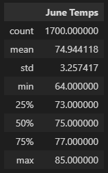
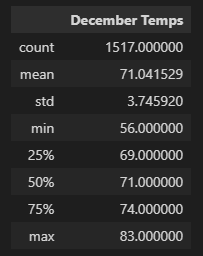
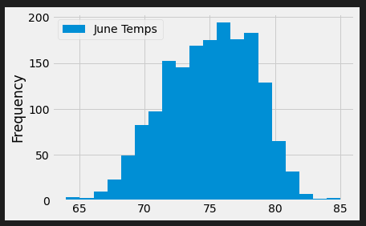
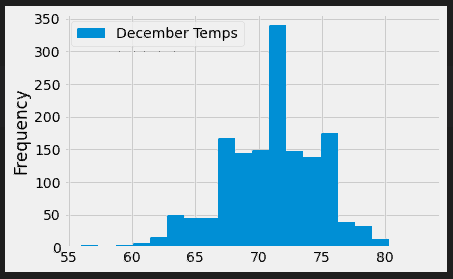

# Surfs Up
## Overview of Analysis
The purpose of this analysis is to review a data set with weather conditions, stored in SQLite. An investor is wanting to fufill his childhood dream and open a Surf and Ice Cream shop in the area, but wants to get more information on the weather in the area. After the investor failed a similar business venture in the past, due to weather, statistical analysis will need to be provided on the weather conditions in Oahu, so he can make a more informed decision.  

## Results
Summary Statistics of June and December Temperatures

  

  

Key Differences of Weather in Oahu, Hawaii:

- The average recorded temperature in June was around 75 degrees, while in December the average temperature was 4 degrees cooler at around 71 degrees. 
- June had a smaller range of temperatures than December. June's max temp was 85° and its low temp was 64°, with a range of only 21°. Meanwhile the month of December had a max temp of 83° and a low temp of 56°, with a larger range of 27°. 
- June and December temperatures standard deviation are roughly similar at 3.26 and 3.75 respectively. When plotted, a majority of their temperatures seem to be near, concentrated towards, their averages and their min and maxes had few days that were recorded in the 'extreme' temperatures.  

## Summary
With the statistics found in the analysis of June and December temperatures, it can be seen that 
