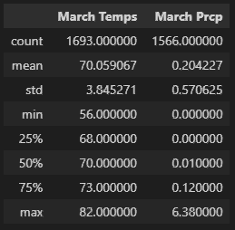
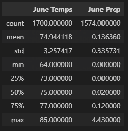
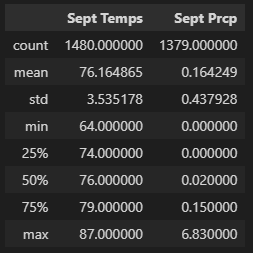
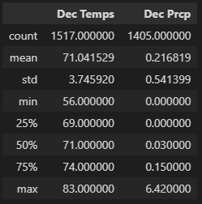

# Surfs Up
## Overview of Analysis
The purpose of this analysis is to review a data set with weather conditions, stored in SQLite. An investor is wanting to fufill his childhood dream and open a Surf and Ice Cream shop in the area, but wants to get more information on the weather in the area. After the investor failed a similar business venture in the past, due to weather, statistical analysis will need to be provided on the weather conditions in Oahu, so he can make a more informed decision.  

## Results
Summary Statistics of June and December Temperatures

  

  

Key Differences of Weather in Oahu, Hawaii:

- The average recorded temperature in June was around 75 degrees, while in December the average temperature was 4 degrees cooler at around 71 degrees. 
- June had a smaller range of temperatures than December. June's max temp was 85° and its low temp was 64°, with a range of only 21°. Meanwhile the month of December had a max temp of 83° and a low temp of 56°, with a larger range of 27°. 
- June and December temperatures standard deviation are roughly similar at 3.26 and 3.75 respectively. When plotted, a majority of their temperatures seem to be near, concentrated towards, their averages and their min and maxes had few days that were recorded in the 'extreme' temperatures.  

## Summary
With the statistics found in the analysis of June and December temperatures, it can be seen that there is not a lot of variation in temperature from Summer to Winter in Oahu. But before investing in a ice cream shop, it would be better to look at precipitation and temperature statistics from all four seasons of the year. 
After running more queries to find out about more about the weather throughout the year, it can be seen that Oahu, Hawaii maintains a very consistent temperature year round with little to no precipitation over 75% of days of the year. So investing in an ice cream surf shop in Oahu seems like a good idea, if temperature and precipitation are the only factors you are considering. 

Summary Statistics from a month in each of the four seasons shown below.

    

  
